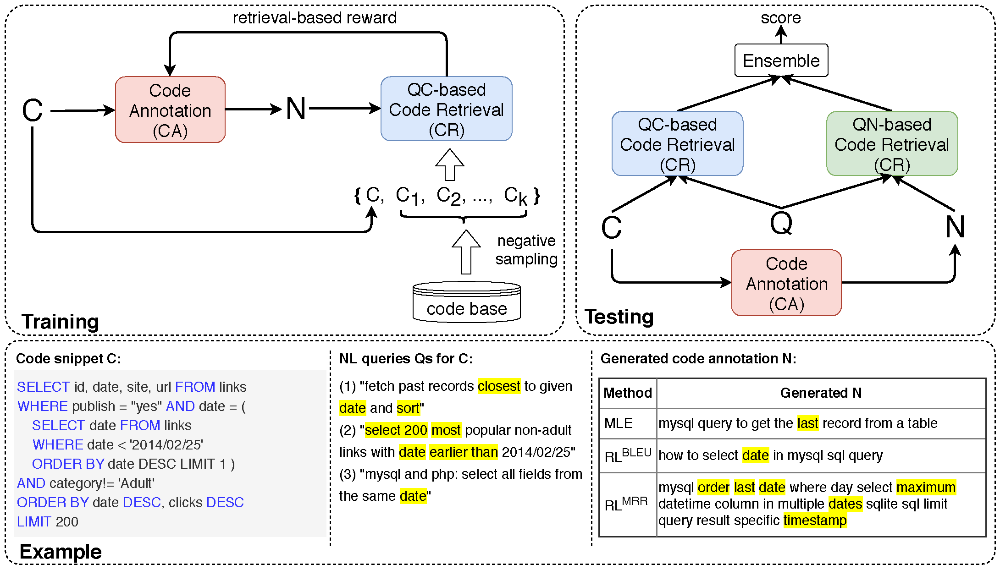

# CoaCor: Code Annotation for Code Retrieval with Reinforcement Learning

## 1. Introduction
This repository contains source code and dataset for paper "[CoaCor: Code Annotation for Code Retrieval with Reinforcement Learning](http://web.cse.ohio-state.edu/~yao.470/paper/CoaCor.pdf)" (To appear at WWW'19), which explores how to generate rich code annotations (CA) that can be useful to code retrieval (CR) task. 


- **Training phase**. A code annotation model is trained via reinforcement learning to maximize retrieval-based rewards given by a QC-based code retrieval model.
- **Testing phase**. Each code snippet is first annotated by the trained CA model. For the code retrieval task, given query Q, acode snippet gets two scores - one matching Q with its code content and the other matching Q with its code annotation N,and is ranked by a simple ensemble strategy. 
- **Example**. We show an example of a code snippet and its associated multiple NL queries in our dataset. The code annotation generated by our framework is much more detailed with many keywords semantically aligned with Qs, when compared with CA models trained via MLE or RL with BLEU rewards.

For more details, please refer to our paper.

### Generation Outputs
Outputs of each CA model, i.e., CodeNN, MLE-based, RL-BLEU and RL_MRR (ours), can be found under folder [final_generations](final_generations/).

## 2. Dataset
### Source Data
**UPDATE 04/20/2020** 
Please decompress the "data/source.tar" file as folder `data/source/`.
The folder contains data from:
- StaQC data: provided by [Yao et al., WWW'18](https://github.com/LittleYUYU/StackOverflow-Question-Code-Dataset). 
- DEV/EVAL set: provided by [Iyer et al., ACL'16](https://github.com/sriniiyer/codenn).

All code snippets/texts have been tokenized for convenience.

If you only want to **reproduce our model**, you can go ahead with the "processed data" (next subsection); If you also want to **reproduce our data processing step**, run:
```
cd code/code_annotation
python run.py preprocess sql
```
Preprocessed data will be saved under:
```
|- code/code_annotation/dataset/train_qt_new_cleaned/
```


### Processed Data
The processed data for CA or CR are under their own folder.
#### Code Annotations
Please decompress the `train_need_decompress.tar` file [here](code/code_annotation/dataset/train_qt_new_cleaned/).
#### Code Retrieval 
All data can be found [here](code/CodeRetrieval-Main/data/). The data can be accessed using "pickle". This folder basically contains:
- The vocabulary for NL question (sql.qt.vocab.pkl) and code snippet (sql.code.vocab.pkl).
- The processed training/validation/test data from StaQC. For example, "sql.train.qt.pkl" contains the NL questions in the training data, and "sql.val.code.pkl" contains the code snippets in the validation data.<br>
By pairing "sql.train.qt.pkl" and "sql.train.code.pkl" line-by-line, you can read pairs of `<question, code>`.
- The processed DEV/EVAL set. For example, "codenn_combine_new.sql.dev.qt.pkl" contains the NL questions in the DEV set, and "codenn_combine_new.sql.eval.code.pkl" contains the code snippets in the EVAL set (as well as their negative samples in evaluation). <br>
Note that we have formatted these two sets to fit [our evaluation implementation](https://github.com/LittleYUYU/CoaCor/blob/master/code/CodeRetrieval-Main/code/codesearcher.py#L128). For example, when pairing "codenn_combine_new.sql.dev.qt.pkl" and "codenn_combine_new.sql.dev.code.pkl" line-by-line, you will read:
```
# The first 50 items correspond to one <q1, c1> pair with its 49 negative code snippets. 
# Note that the dataset contains three NL descriptions for each positive code snippet, so we have [q11, q12, q13].
item0: [q11, q12, q13], pos code c1
item1: [q11, q12, q13], neg code1
...
item49:[q11, q12, q13], neg code49

# The second 50 items correspond to another <q2, c2> pair with its 49 negative code snippets.
item50:[q21, q22, q23], pos code c2
item51:[q21, q22, q23], neg code1
...
item99:[q21, q22, q23], neg code49

# Since DEV originally has 111 positive code snippets, the size of our processed data = 50 * 111 * 20 (20 runs as Iyer et al.) = 111000.
# For EVAL: 50 * 100 * 20 = 100000.
```
In [our evaluation implementation](https://github.com/LittleYUYU/CoaCor/blob/master/code/CodeRetrieval-Main/code/codesearcher.py#L128), the data loader loads 50 items per batch, and computes the similarity between each question and each code snippet (e.g., `q11 vs. pos code c1`, `q11 vs. neg code1`, `q12 vs. pos code c1`).


## 3. Code
### Requirements
- python 2.7
- pytorch 0.4.1

### Run Code Annotation model
Source code is under folder [code/code_annotation/](code/code_annotation/). 

For MLE training, see `run_mle.sh`.

For RL-MRR training, please first pretrain the generator via "MLE training", then run `run.sh`.

Please refer to [code/code_annotation/run.py](code/code_annotation/run.py) for mode details.

### Run Code Retrieval model
Source code is under folder [code/CodeRetrieval-Main/code/](code/CodeRetrieval-Main/code/). 

For training, see `run_train.sh`.

For testing, see `run_eval.sh`.

**NOTE**: We provide checkpoints and outputs of the [QC-based CR model](code/CodeRetrieval-Main/checkpoint/QC_valcodenn/qtlen_20_codelen_120_qtnwords_7775_codenwords_7726_batch_256_optimizer_adam_lr_001_embsize_200_lstmdims_400_bowdropout_35_seqencdropout_35_codeenc_bilstm/) and [QN-RL-MRR CR model](code/CodeRetrieval-Main/checkpoint/QN_rl_mrr_valcodenn/qtlen_20_codelen_120_qtnwords_7775_codenwords_7726_batch_256_optimizer_adam_lr_001_embsize_200_lstmdims_400_bowdropout_35_seqencdropout_35_codeenc_bilstm/) under the [checkpoint folder](code/CodeRetrieval-Main/checkpoint/). Please rename them if you would train your own model and overwrite these folders.


## 4. Citation
Please kindly cite the following paper if you use the code or the dataset in this repo:
```
@inproceedings{yao2019coacor,
  title={CoaCor: Code Annotation for Code Retrieval with Reinforcement Learning},
  author={Yao, Ziyu and Peddamail, Jayavardhan Reddy and Sun, Huan},
  booktitle={The World Wide Web Conference},
  pages={2203--2214},
  year={2019},
  organization={ACM}
}
```

## 5. Acknowledgement

Our implementation is adapted from: https://github.com/wanyao1992/code_summarization_public and https://github.com/khanhptnk/bandit-nmt for CA and https://github.com/guxd/deep-code-search for CR.


